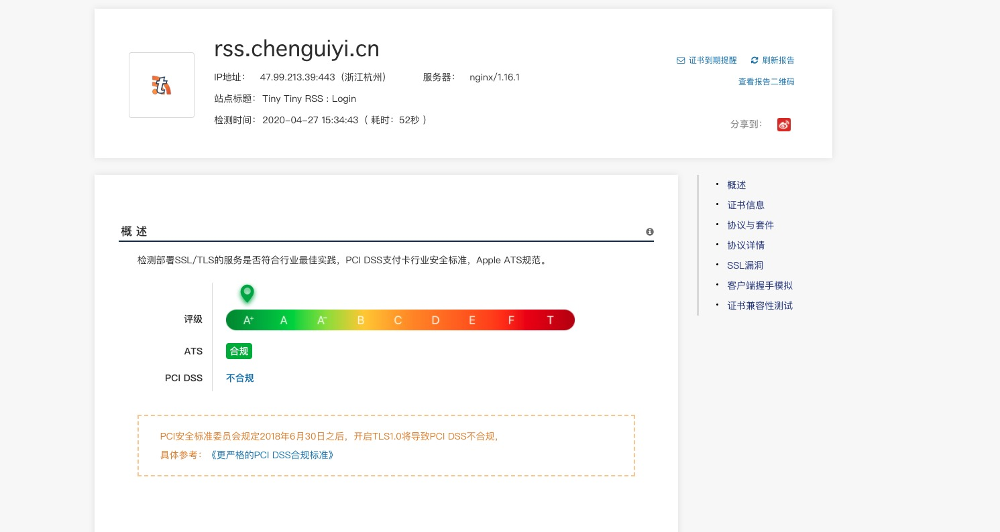

+++
title = "Letsencrypt 申请HTTPS证书"
date = "2020-04-27T16:42:06+08:00"
draft = false
tags = ["HTTPS"]
categories = ["HTTPS"]

+++
rss.chenguiyi.cn 配置RSA和ECC双证书

### 安装[acme.sh](https://github.com/acmesh-official/acme.sh)

```sh
curl  https://get.acme.sh | sh
```

然后创建一个bash的alias，方便使用

```sh
alias acme.sh=~/.acme.sh/acme.sh
```

### 配置阿里云账号

我的域名是托管在阿里云上面的，使用dnsapi开直接生成更方便，以后就可以自动更新证书了，更多的dnsapi可以参考[dnsapi](https://github.com/acmesh-official/acme.sh/wiki/dnsapi)

阿里云只需要创建一个带有*AliyunDNSFullAccess*权限的子用户

```sh
export Ali_Key="sdfsdfsdfljlbjkljlkjsdfoiwje"
export Ali_Secret="jlsdflanljkljlfdsaklkjflsa"	
```

### RSA

```sh
acme.sh --issue --dns dns_ali -d *.chenguiyi.cn -d chenguiyi.cn
```

```sh
acme.sh --installcert -d "*.chenguiyi.cn" --key-file "/etc/nginx/ssl/*.chenguiyi.cn.key" --fullchain-file "/etc/nginx/ssl/*.chenguiyi.cn.cer" --reloadcmd "service nginx force-reload"
```

### ECC

```sh
acme.sh --issue --dns dns_ali -d *.chenguiyi.cn -d chenguiyi.cn --keylength ec-256
```

```sh
acme.sh --installcert -d "*.chenguiyi.cn" --ecc --key-file "/etc/nginx/ssl/*.chenguiyi.cn.key" --fullchain-file "/etc/nginx/ssl/*.chenguiyi.cn.cer" --reloadcmd "service nginx force-reload" 
```

### Nginx配置

```nginx
server {
  listen 443 ssl;
  gzip on;
  server_name  rss.chenguiyi.cn;
  ssl_certificate /etc/nginx/ssl/*.chenguiyi.cn.cer;
    ssl_certificate_key /etc/nginx/ssl/*.chenguiyi.cn.key;

    ssl_certificate /etc/nginx/ssl/*.chenguiyi.cn_ecc.cer;
    ssl_certificate_key /etc/nginx/ssl/*.chenguiyi.cn_ecc.key;

    ssl_ciphers    ECDHE-ECDSA-AES128-GCM-SHA256:ECDHE-ECDSA-CHACHA20-POLY1305:ECDHE-RSA-AES128-GCM-SHA256:ECDHE-RSA-CHACHA20-POLY1305:ECDHE+AES128:RSA+AES128:ECDHE+AES256:RSA+AES256:ECDHE+3DES:RSA+3DES;

    ssl_protocols TLSv1.2 TLSv1.3;
    ssl_prefer_server_ciphers   on;

    add_header Strict-Transport-Security "max-age=31536000";

    access_log /var/log/nginx/ttrssdev_access.log combined;
    error_log  /var/log/nginx/ttrssdev_error.log;

    location / {
    proxy_pass http://ttrssdev;
}

```

重启一下nginx就完成了

```sh
nginx -s reload
```

### SSL检测

[myssl](https://myssl.com/)

